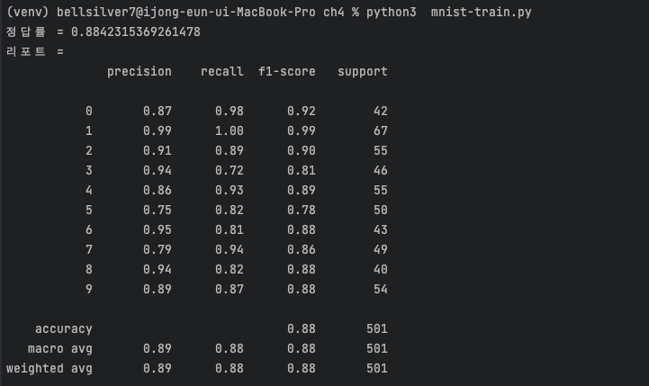
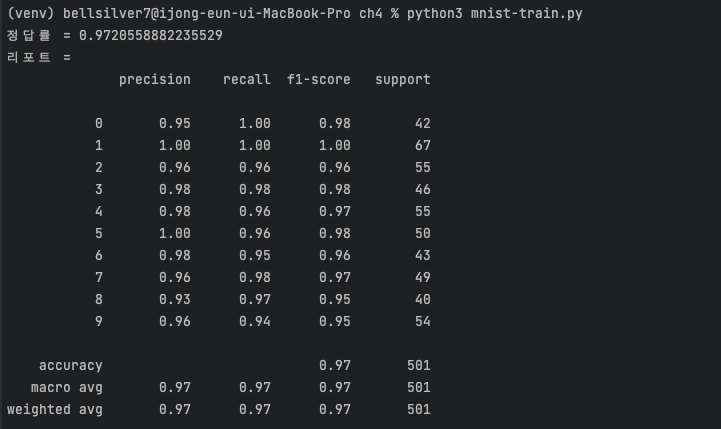
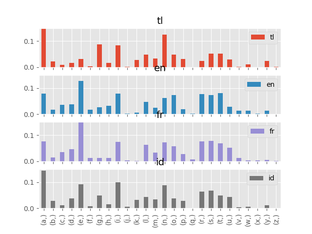
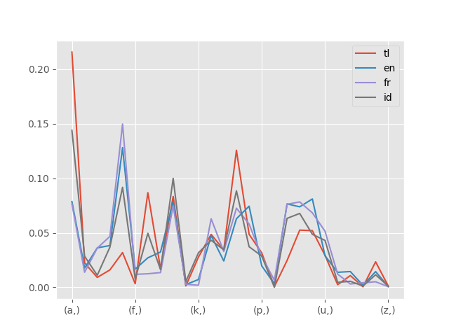

# 4장 머신러닝

## 4-1 머신러닝이란?

### 머신러닝 개요

수많은 데이터를 학습시켜 거기에 있는 패턴을 찾아내는 것

**특징 추출**

- 데이터가 어떤 특징을 가지고 있는지 찾고 벡터로 만들어야 한다.
- 일반적으로 사용되는 머신러닝 프레임워크는 범용적인 용도로 내가 원하는 특징을 추출해주는 기능은 없다.
- 어떤 특징을 추출할지는 프로그래머가 결정해야하며 이것이 머신러닝의 포인트라고 할 수 있다.
- 학습을 기반으로 분류 등을 하는 시스템을 "학습 기계"라고 부르는데, "분류/식별기(classifier)", "학습기(learner)"라고 부르는 경우도 있다.

**회귀 분석**

- 통계 용어로, Y가 연속된 값일 때 Y = f(x)와 같은 모델로 나타내는 것.
- 가장 기본적인 모델은 선형 회귀(Y = aX + b)
- Y를 연속 측정의 종속 변수(목표 변수), X를 독립 변수(설명 변수)
- X가 1차원이라면 "단순 회귀", 2차원 이상이면 "다중 회귀"

### 머신러닝의 종류

| 종류    | 설명                      |
|-------|-------------------------|
| 교사학습  | 데이터와 함께 답을 입력한다.        |
|       | 다른 데이터의 답을 예측한다.        |
| 비교사학습 | 데이터는 입력하지만 답은 입력하지 않는다. |
|       | 다른 데이터의 규칙성을 찾는다.       |
| 강화학습  | 부분적으로 답을 입력한다.          |
|       | 데이터 기반으로 최적의 답을 찾는다.    |

**교사학습**

**비교사학습**

- 일반적으로 사람도 알 수 없는 본질적인 구조 등을 확인할 때 사용.
- 예) 클러스터 분석, 주성분 분석, 벡터 양자화, 자기 조직화

**강화학습**

- 현재 상태를 관찰해서 어떻게 대응해야 할지와 관련된 문제를 다룬다.
- "행동의 주체"와 "환경(상황 또는 상태)"가 등장한다.
- 행동의 주체는 환경을 관찰하고, 이를 기반으로 의사결정을 내려 행동한다. 이때 환경이 변화하면서 행동의 주체가 어떤 보상을 받는다. 이를 기반으로 행동의 주체는 더 많은 보상을 얻을 수 있는 방향으로 행동을
  학습하게 된다.

### 머신러닝의 흐름

1. 데이터 수집: 어느 정도 양의 데이터를 수집해야 한다.
2. 데이터 가공: 프로그램이 다루기 쉬운 형태롤 데이터를 가공.
3. 데이터 학습:
    1. 어떤 방법(알고리즘)을 사용해 학습을 시킬지 생각
    2. 데이터와 알고리즘에 맞게 매개변수 지정
4. 모델 평가: 테스트 데이터를 활용해 어느 정도의 정밀도가 나오는지 확인. 원하는 결과가 나오지 않는다면 매개변수를 수정하거나 알고리즘을 변경하는 방법 등을 검토하며 반복해야 한다.

### 머신러닝의 응용 분야

**클래스 분류(Classification)**

- 특정 데이터에 레이블을 붙여 분류.
- 예) 스팸 메일 분류, 필기 인식, 증권 사기

**클러스터링 - 그룹 나누기(Clustering)**

- 값의 유사성을 기반으로 데이터를 여러 그룹으로 나눈다.
- 사용자의 취향을 그룹으로 묶어 사용자 취향에 맞는 광고를 제공하는 경우를 의마할 수 있다.

**추천(Recommendation)**

- 특정 데이터를 기반으로 다른 데이터를 추천하는 것.
- 사용자가 인터넷 서점에서 구매한 책들을 기반으로 다른 책을 추천하는 경우.

**회귀(Regression)**

- 과거의 데이터를 기반으로 미래의 데이터를 예측하는 것.
- 판매 예측, 주가 변동 등.

**차원 축소(Dimensionality Reduction)**

- 데이터의 특성을 유지하면서 데이터의 양을 줄이는 것.
- "특성을 유지한 상태로 차원의 데이터를 저차원의 데이터로 변환하는 것".
- 데이터를 시각화하거나 구조를 추출해서 용량을 줄여 계산을 빠르게 하거나 메모리를 절약할 때 사용.

### 초과 학습

새로운 데이터에 대해 제대로 된 예측을 못하는 상태를 의미. 즉, 배운 것밖에 해결하지 못하는 상황.

- 데이터가 너무 적은 경우
- 모델에 비해 문제가 너무 복잡한 경우

## 4-2 머신러닝 첫걸음

### 머신러닝 프레임워크 scikit-learn

머신러닝 라이브러리의 정석과도 같은 scikit-learn은 다양한 분류기를 지원하며, 머신러닝의 결과를 검증하는 기능도 가지고 있다. 또한 분류, 회귀, 클러스터링, 차원 축소처럼 머신러닝에서 자주 사용되는 다양한
알고리즘을 지원한다.

**설치**

```shell
$ pip install -U scikit-learn scipy matplotlib scikit-image
```

데이터를 읽고 분할하기 위한 pandas 패키지도 설치

```shell
$ pip install pandas
```

### XOR 연산 학습해보기

두 입력 중 하나만 참이고, 다른 한 쪽이 거짓일 때 참이 나온다.

| P   | Q   | P xor Q |
|-----|-----|---------|
| 0   | 0   | 0       |
| 1   | 0   | 1       |
| 0   | 1   | 1       |
| 1   | 1   | 0       |

```shell
$ python3 xor-train.py
예측결과: [0 1 1 0]
정답률: 4 / 4 = 1.0
```

- svm : The sklearn.svm module includes Support Vector Machine algorithms.
- SVC() : Support Vector Classification.
- fit() : Fit the SVM model according to the given training data.

[1] 학습 기계에 데이터를 학습시킨다 - fit()
[2] 데이터를 넣어 예측시킨다 - predict()

.ix 함수는 pandas에서 삭제되고 .loc 혹은 .iloc 사용이 권고됨.

### 붓꽃 품종 분류하기

train_test_split() 메서드를 사용해 훈련 전용 데이터와 학습 전용 데이터를 분할

**정리**

- 머신러닝을 이용해 데이터를 분류할 수 있다.
- 교사 학습을 할 때는 데이터와 정답 레이블을 지정해야한다.
- 훈련 전용 데이터와 테스트 ㅓㅈㄴ용 데이터를 반할하거나, 정답률을 계산하는 것처럼 자주 사용하는 기능에 대해한 메서드가 제공된다.

## 4-3 이미지 내부의 문자 인

### 손글씨 숫자 인식하기

```shell
!wget http://yann.lecun.com/exdb/mnist/train-images-idx3-ubyte.gz
!gunzip train-images-idx3-ubyte.gz
!wget http://yann.lecun.com/exdb/mnist/train-labels-idx1-ubyte.gz
!gunzip train-labels-idx1-ubyte.gz
!wget http://yann.lecun.com/exdb/mnist/t10k-images-idx3-ubyte.gz
!gunzip t10k-images-idx3-ubyte.gz
!wget http://yann.lecun.com/exdb/mnist/t10k-labels-idx1-ubyte.gz
!gunzip t10k-labels-idx1-ubyte.gz
```

### 이미지 데이터 학습시키기

- 1000개 데이터 학습 결과
  

- 99999개 데이터 학습 결과
  

### 정리

- 손글씨 데이터 'MNIST'는 머신러닝 예제로 유명하다.
- 대량의 데이터를 처리하는 데는 시간이 걸리므로 일단 조금만 가지고 테스트하는 것도 좋다.
- 머신러닝의 결과를 확인하려면 훈련 데이터로 사용하지 않은 테스트 데이터를 사용해야 한다.

## 4-4 외국어 문장 판별하기

### 판정 방법

- 언어가 다르면 알파벳의 출현 빈도가 다르다
- "a"부터 "z"까지의 출현 빈도를 확인하고 이를 특징으로 사용

### 언어 판별 프로그램

- 데이터마다의 분포를 그래프로 확인하기 (lang-plot.py)
  

- "_tkinter.TclError: no display name and no $DISPLAY environment variable" 에러가 발생할 경우
  ```shell
  export MPLBACKEND="agg"
  ```

- 다른 종류의 그래프
  

### 웹 인터페이스 추가하기

- 학습한 매개변수를 저장하는 프로그램

```python
# ImportError: cannot import name 'joblib' from 'sklearn.externals'
# 위와 같이 모듈 에러가 발생해 joblib 모듈은 직접 import 하도록 변경
# from sklearn.externals import joblib
import joblib
```

```shell
$ docker run -it -v $HOME:$HOME -p 8080:8080 mlearn
docker: Error response from daemon: pull access denied for mlearn, repository does not exist or may require 'docker login': denied: requested access to the resource is denied.
```


docker 실행시 위와 같이 이미지를 내려 받지 못해 웹 실행은 패스

### 정리

- Pandas/matpolotlib을 사용해 간단하게 그래프를 그릴 수 있다.
- 데이터 그래프로 시각화하면 데이터의 특징과 경향 등을 파악할 수 있다.
- 머신러닝의 학습 결과를 파일로 저장하면 웹 애플리케이션 등에서 활용할 수 있다.
 


## 4-5 서포트 벡터 머신(SVM)

### SVM 이란?

머신러닝 방법 중 하나로 선을 구성하는 매개변수를 조정해서 요소들을 구분하는 선을 찾고, 이를 기반으로 패턴을 인식하는 방법이다. 또한, 다양한 연구가 활발하게 진행되어 굉장히 높은 인식 성능을 발휘하는 방법이다.

예를 들어, A와 B라는 두 가지 패턴이 있을 때 A와 B라는 패턴을 구분하는 방법을 찾는 것이 패턴 인식의 목표다. 이를 위해 A와 B를 벡터로 나타내서 평면 위에 올리고 구분선을 그리게 된다. 이 때 패턴의 경계가 되는 것을 "식별 평면"이라고 한다.

A와 B의 정확히 중간을 지나는 선이 가장 좋으며, 식별 평면에서 패턴들과의 거리(마진)를 최대로 만드는 것이 가장 좋은 결과다. => 마진 최대화

SVM을 이용하면 알 수 없는 패턴도 제대로 분류할 확률이 굉장히 높다. 이를 학습 이론에서는 "일반화 능력"이라고 부른다.